#### 1. Tổng quan Hệ thống TSL-SignMap

**TSL-SignMap** là hệ thống quản lý, đóng góp và tra cứu thông tin biển báo giao thông không gian GIS (chuẩn dữ liệu địa lý SRID 4326), được vận hành trên hạ tầng đám mây AWS với thiết kế **VPC 3-Tier Multi-AZ**, các máy chủ **AWS EC2 Instances**, tích hợp **AI SageMaker (YOLO)** và CSDL **RDS SQL Server 2022**.

Hệ thống được phát triển nhằm giải quyết bài toán quản lý biển báo giao thông tập trung, cho phép người dùng tra cứu vị trí, gửi đóng góp biển báo mới, hỗ trợ nhận diện biển báo qua hình ảnh AI và đồng bộ tự động dữ liệu từ OpenStreetMap.

---

#### 2. Danh sách 9 Dịch Vụ AWS Chính Thức Trong Hạ Tầng

| STT | Dịch Vụ AWS | Vai Trò & Chức Năng Chi Tiết | Thông Số & Cổng |
| :--- | :--- | :--- | :--- |
| 1 | **AWS CloudFront** | Mạng phân phối nội dung (CDN) toàn cầu cho ứng dụng React Admin Web (`ADMIN.WEB`), nạp trang `< 100ms`. | Port 443 (HTTPS) |
| 2 | **AWS Simple Storage Service (S3)** | Lưu trữ các tệp tĩnh Frontend (`dist/`) và các tệp ảnh biển báo người dùng tải lên (`S3 Media Bucket`). | S3 Standard Bucket |
| 3 | **AWS Application Load Balancer (ALB)** | Cân bằng tải và định tuyến kết nối HTTPS API (`/api/*`) từ ngoài Internet vào Ocelot API Gateway. | Public Subnet `10.0.1.0/24` |
| 4 | **AWS Elastic Container Registry (ECR)** | Kho lưu trữ các Docker Container Images bảo mật cho 8 Microservices & Python Scraper. | Private Docker Registry |
| 5 | **AWS Amazon EC2 (Elastic Compute Cloud)** | Máy chủ ảo EC2 chạy Docker Containers cho 8 Microservices (Ocelot API Gateway + 7 Services) & EC2 Scraper Instance. | Private App Subnet `10.0.2.0/24` |
| 6 | **AWS Cloud Map** | Dịch vụ Service Discovery DNS nội bộ mạng VPC (`*.local`) giúp Ocelot API Gateway điều hướng đến 7 Microservices. | Internal DNS `*.local` |
| 7 | **AWS Relational Database Service (RDS)** | Cơ sở dữ liệu SQL Server 2022 lưu trữ 1,286+ biển báo GIS geography SRID 4326, user và giao dịch. | Port 1433 (Private DB Subnet `10.0.3.0/24`) |
| 8 | **AWS EventBridge** | Đặt lịch Cronjob (`0 2 * * ? *` - 2h sáng) tự động kích hoạt Python Scraper cào dữ liệu 15 tỉnh thành. | Cron Schedule |
| 9 | **AWS Secrets Manager & ACM** | Quản lý mã hóa bí mật (Connection Strings/JWT Keys) và cấp chứng chỉ SSL HTTPS miễn phí cho ALB. | Encrypted Secrets / TLS |

---

#### 3. Cấu trúc Phân Mạng VPC 3-Tier (VPC Architecture)

- **AWS Region:** Singapore (`ap-southeast-1`)
- **AWS VPC CIDR:** `10.0.0.0/16`
- **Các phân vùng Subnet Multi-AZ (AZ-A & AZ-B):**
  1. **Public Subnet (`10.0.1.0/24`):** Chứa AWS Application Load Balancer (ALB) nhận traffic công cộng và các NAT Gateway.
  2. **Private App Subnet (`10.0.2.0/24`):** Chứa các cụm máy chủ AWS EC2 Instances gồm 8 Microservices:
     - `ApiGateway Container` (Port 5008 - Ocelot API Gateway)
     - `UserService` (Port 5001)
     - `TrafficSignService` (Port 5002)
     - `ContributionService` (Port 5003)
     - `FeedbackService` (Port 5004)
     - `PaymentService` (Port 5005)
     - `RewardService` (Port 5006)
     - `NotificationService` (Port 5007)
     - `EC2 Scraper Instance` (`scrape_signs.py`)
     - `AWS Cloud Map` (Service Discovery) & `SageMaker AI Endpoint` (YOLO AI model)
  3. **Private DB Subnet (`10.0.3.0/24`):** Chứa CSDL AWS RDS for SQL Server 2022 (Port 1433) mô hình Primary - Standby và cụm cache Amazon ElastiCache (Redis).

---

#### 4. Sơ Đồ Kiến Trúc Hệ Thống (System Architecture Diagram)

```mermaid
graph TB
    subgraph AWSCloud["AWS Cloud"]
        subgraph Region["AWS Region: Singapore (ap-southeast-1)"]
            
            subgraph EdgeLayer["Edge & Security Services"]
                CF["AWS CloudFront<br/>(React Admin Web CDN)"]
                S3Web["AWS S3 Bucket<br/>(Frontend dist/ Static Assets)"]
                ACM["AWS Certificate Manager (ACM)<br/>(SSL/TLS HTTPS)"]
                SECRETS["AWS Secrets Manager<br/>(Connection Strings & JWT Keys)"]
                EB["AWS EventBridge<br/>(Cron: 0 2 * * ? *)"]
            end

            subgraph VPC["AWS VPC (10.0.0.0/16)"]
                
                subgraph PublicSubnet["Public Subnet (10.0.1.0/24)"]
                    ALB["AWS Application Load Balancer (ALB)<br/>(HTTPS API Routing /api/*)"]
                end

                subgraph PrivateAppSubnet["Private App Subnet (10.0.2.0/24)"]
                    subgraph EC2Cluster["AWS EC2 Instances"]
                        GW["ApiGateway Container<br/>(Port 5008)"]
                        
                        US["UserService (5001)"]
                        TS["TrafficSignService (5002)"]
                        CS["ContributionService (5003)"]
                        FS["FeedbackService (5004)"]
                        PS["PaymentService (5005)"]
                        RS["RewardService (5006)"]
                        NS["NotificationService (5007)"]

                        SCRAPER["EC2 Scraper Instance<br/>(scrape_signs.py)"]
                    end
                    
                    CM["AWS Cloud Map<br/>(Service Discovery DNS *.local)"]
                    SM["SageMaker Endpoint<br/>(YOLO AI Model)"]
                end

                subgraph PrivateDBSubnet["Private DB Subnet (10.0.3.0/24)"]
                    RDS[("AWS RDS for SQL Server 2022<br/>(Port 1433 \| 1,286+ Signs GIS SRID 4326)")]
                    CACHE["Amazon ElastiCache<br/>(Redis Cache)"]
                end

            end

            S3Media["AWS S3 Media Bucket<br/>(Uploaded Sign Images)"]
            ECR["AWS Elastic Container Registry (ECR)<br/>(Docker Container Images)"]
        end
    end

    CLIENT_WEB["Client Admin Web"] -->|HTTPS| CF
    CF -->|Fetch static site| S3Web
    CLIENT_APP["Client Mobile / Web"] -->|HTTPS /api/*| ALB
    ACM -.->|HTTPS Cert| ALB

    ALB -->|Forward HTTPS| GW

    CM -.->|DNS Routing *.local| GW
    GW -->|Port 5001| US
    GW -->|Port 5002| TS
    GW -->|Port 5003| CS
    GW -->|Port 5004| FS
    GW -->|Port 5005| PS
    GW -->|Port 5006| RS
    GW -->|Port 5007| NS
    GW -->|SageMaker VPCE| SM

    US -->|Port 1433| RDS
    TS -->|Port 1433| RDS
    CS -->|Port 1433| RDS
    FS -->|Port 1433| RDS
    PS -->|Port 1433| RDS
    RS -->|Port 1433| RDS
    NS -->|Port 1433| RDS

    CS -->|Upload Images| S3Media

    EB -->|Trigger 2h sáng| SCRAPER
    SCRAPER -->|Cập nhật CSDL| RDS
    SCRAPER -->|Cache Data| CACHE

    ECR -.->|Pull Images| EC2Cluster
    SECRETS -.->|Inject Secrets| EC2Cluster
    SECRETS -.->|Inject Secrets| RDS
```

